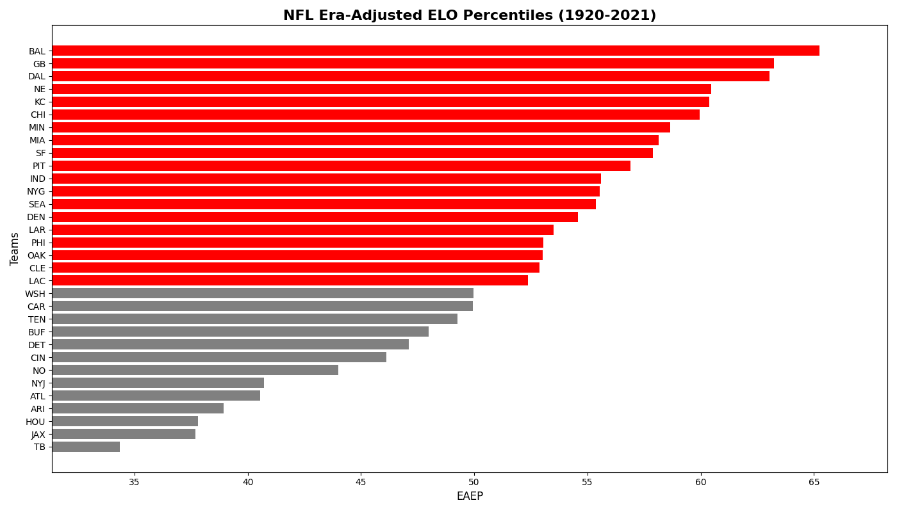
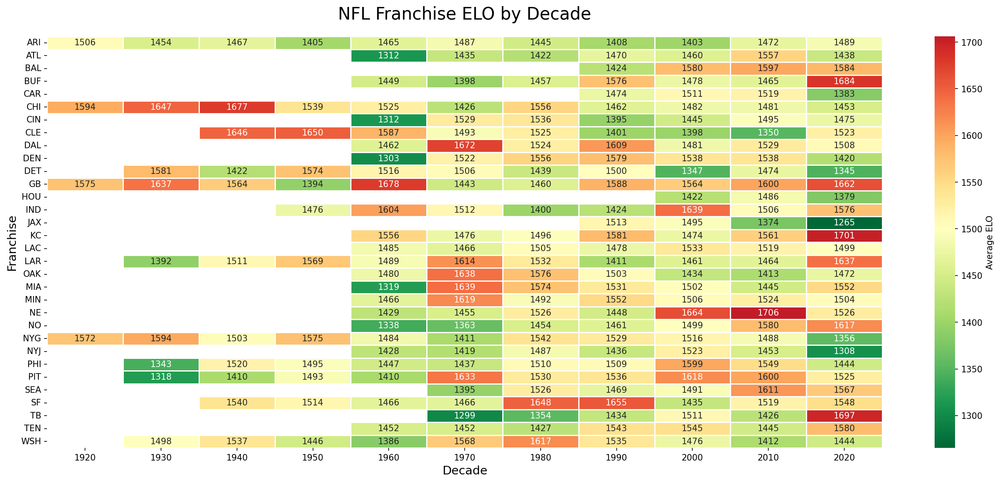
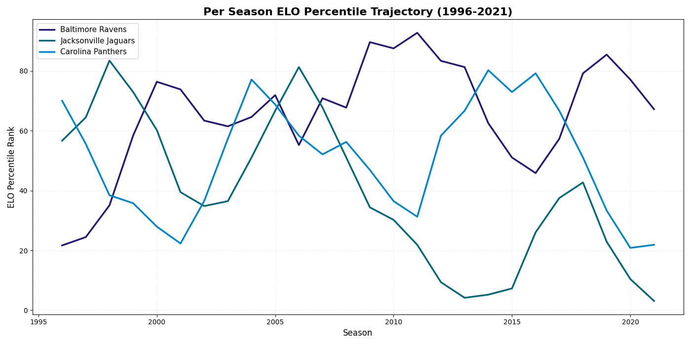
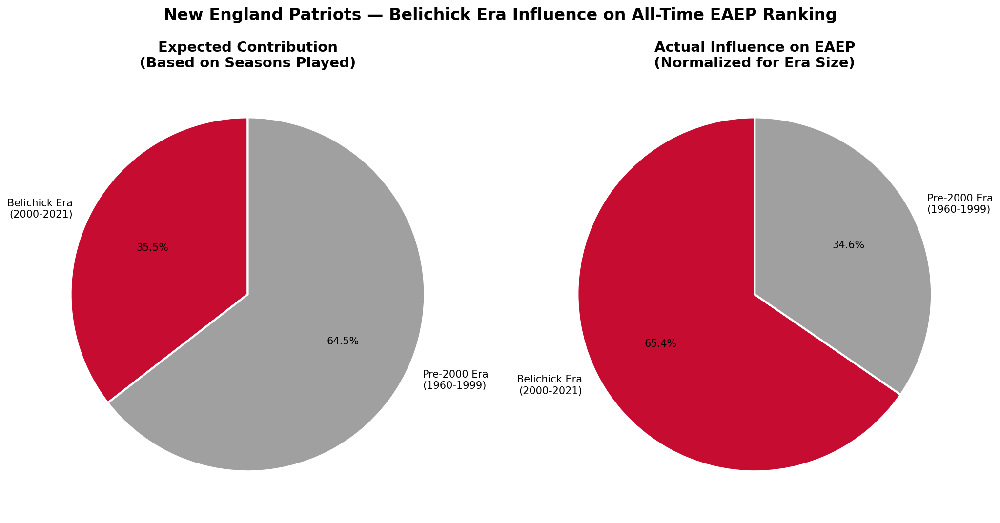
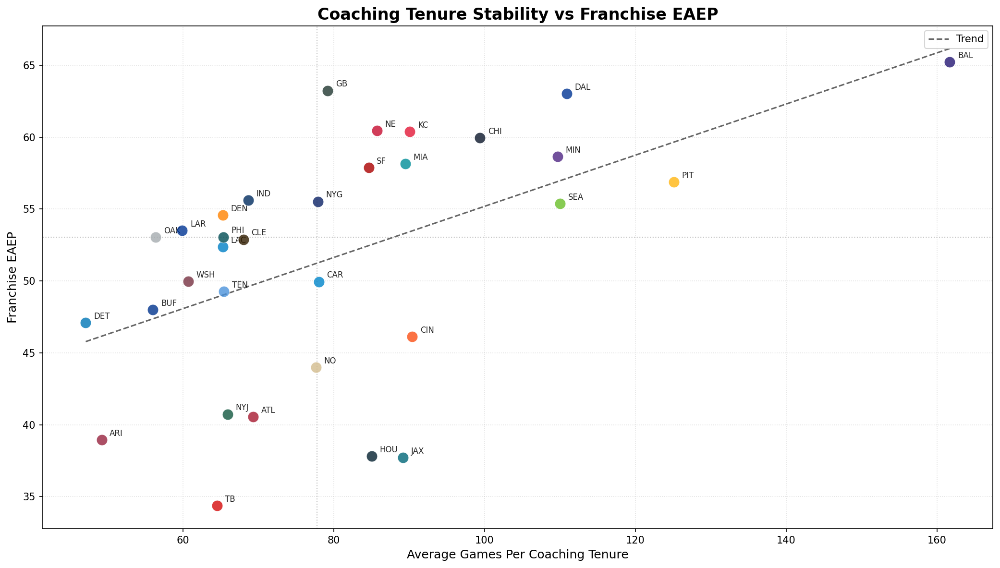
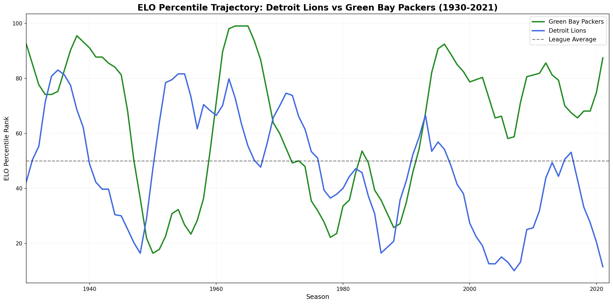
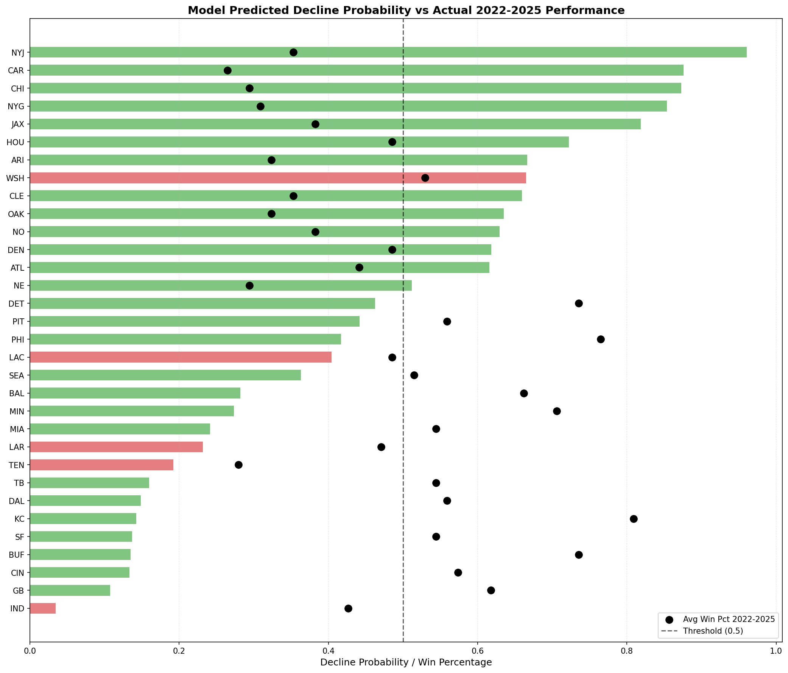

# EAEP: An Era-Adjusted Framework for Measuring and Predicting NFL Franchise Performance

This project introduces EAEP (Era-Adjusted ELO Percentile), an original metric that ranks NFL franchises against their contemporaries each season and averages those rankings across franchise history.  This produces an era-neutral measure of sustained competitive performance.  Built on FiveThirtyEight's ELO dataset, the analysis uses EAEP to investigate coaching stability, draft efficiency, and quarterback value across 100 years of NFL history, culminating in a logistic regression model that predicts franchise decline with 84% real-world accuracy.
 
 
First, the 30,000 foot view of how each current NFL franchise ranks by lifetime EAEP, with teams in red being above league-average EAEP (50), and those in gray below. The results align with intuition, storied franchises like Dallas, Green Bay, and San Francisco cluster at the top while historically poor franchises like Arizona, Tampa Bay, and the NY Jets sit at the bottom, but the order and margins tell a more nuanced story.

 
 
For a more granular look at NFL franchise histories, we can take the raw ELO and average it across each decade from the 1920s to the 2020s. This allows us to see how each franchise performed in the different eras of the NFL. The heatmap shows the early dominance from franchises like Green Bay and Chicago, which quickly faded into mediocrity, and then how both franchise trajectories diverged. We can see how franchises like New England and San Francisco sustained long spells of competitive irrelevance until periods of league dominance. And then we have examples like Arizona and the NY Jets who have never been able to build any sort of sustained competitive relevance, forever mired in mediocrity.

 
 
 

## Key Findings

The Baltimore Ravens ranked #1 in Total EAEP despite only existing for 25 years within the dataset. The initial assumption was sample size bias since a young franchise would not have had time to suffer the periods of decline that drag down overall EAEP. However, comparing their trajectory against the Carolina Panthers and Jacksonville Jaguars, who entered the league at the same time, revealed something different. Both the Panthers and Jaguars suffered steep declines and frequent fluctuations while the Ravens maintained above league average EAEP throughout their entire existence. A key factor: the Ravens were not a true expansion team. They were the 1995 Cleveland Browns relocated to Baltimore, meaning they bypassed the roster-building years that bury most new franchises in below-average ELO territory.
 
 

The Bill Belichick era (2000-2021) accounts for 65% of the Patriots total EAEP result despite representing only 35% of their franchise existence. Before Belichick, the Patriots were a mediocre franchise by EAEP standards, averaging near league average for 40 years. Those 22 seasons under Belichick catapulted a historically average franchise into the top 5 all-time. Looking at the Patriots through EAEP reveals the full extent to which two decades of dominance completely rewrote their franchise narrative.
 
 

Coaching stability accounts for 26.8% of franchise EAEP variance across all 32 franchises (p=0.002), a statistically significant but incomplete picture. Franchises like Baltimore, Pittsburgh, Dallas, and Minnesota show the expected pattern of long tenures producing sustained success. But Tampa Bay sits in the lower right quadrant, high average tenure with mediocre EAEP, because their first decade was historically bad and no amount of later stability could overcome it. The finding is not that stability causes success, but that instability almost always prevents it.
 
 

The Detroit Lions and Green Bay Packers followed nearly identical EAEP trajectories from the 1940s through the early 1990s. Both franchises were declining. Then in 1994 they diverged completely. Green Bay hired Ron Wolf as GM, drafted Brett Favre, and brought in Mike Holmgren as head coach. Their EAEP rose sharply and never came back down. Detroit changed nothing organizationally and their decline continued for another 30 years. Same era, same trajectory, completely different organizational decisions. The data makes the cost of those decisions impossible to ignore.
 
 

The sustained decline prediction model achieved 84.4% accuracy when validated against actual 2022-2025 franchise outcomes, a true out-of-sample test against real world results. High confidence decline predictions including NYJ, CAR, CHI, NYG, and JAX all averaged below .500 from 2022-2025. Low confidence predictions including KC, SF, BUF, and BAL all remained competitive. The five misses were instructive: WSH was saved by new ownership and Jayden Daniels, TEN and IND collapsed due to QB instability the model could not have seen coming. The model identifies organizationally fragile franchises with statistical consistency but cannot predict the black swan events that sometimes rescue them.

## Methodology
ELO is an excellent metric when used to predict the outcome of zero-sum games like chess, online gaming, or professional football.  It excels at predicting the outcome of singular games, where the recency of performance has a great effect on the outcome of the game.  Its efficacy begins to fall apart when it is used to predict outcomes over longer periods of time, such as multiple NFL seasons.  Since the main purpose of this project was to investigate NFL franchise performance over multiple decades and then use the insights gathered to model future NFL season predictions, raw ELO is insufficient for this purpose. Therefore, we aggregated raw ELO scores into a more useful metric, EAEP.

Era-Adjusted ELO Percentile (EAEP) is an ELO-derived metric that removes the cumulative and era bias that plagues standard ELO evaluations across NFL eras.  For each NFL season, each franchise is ranked by end-of-season ELO as a percentile relative to other franchises that season.  Those percentile ranks are then averaged across all seasons the franchise has existed and scaled to 0-100.

$$EAEP_i = (\frac{1}{T_i}\sum^{T_i}_{t=1} P_{i,t})* 100$$

Where:
- $i$ = franchise
- $T_i$ = total seasons franchise $i$ has existed
- $P_{i,t}$ = percentile rank of franchise $i$'s end-of-season ELO among all franchises in season $t$

Using EAEP rather than raw ELO scores to compare franchises across diverse NFL eras, allows one to remove much of the cumulative and era bias that plagues the typical comparison of NFL teams across different eras.  A 1950s NFL team existed under wildly different circumstances than a 1990s team.  For example, there were only 12-13 NFL teams in the 1950s, as opposed to 30+ in the 1990s.  The forward pass was still a bit of a novelty and under utilized in 1950s football, whereas passing was an essential part of the game in the 1990s.  EAEP allows us to account for these disparities by comparing the performance of each team against only those it faced in that specific season (a rank percentile), and then taking the mean of that rank percentile over the life of the franchise.  So rather than comparing a raw ELO score from one season against another season 40 years in the future, where a 1550 ELO in 1955 may mean something different than a 1550 ELO in 1995, we compare how each team ranked in each season.  A reasonable question would be, "Why not just average season-end ELO across a franchise's lifetime".  The 1955 Cleveland Browns had a 1650 ELO and the 2005 Patriots had a 1750 ELO.  The Browns existed in a 13 team league, while the Patriots played in a 32 team league.  The distribution of season-end ELOs are completely different for each example.  A simple average of the raw ELOs would treat them as equal though, which is certainly not the case.  This is why rank percentile metric is a more accurate representation of how each team performed in each season, with minimal era bias.  Of course there are still limitations in that a #1 EAEP ranking in a 12 team league may not be as impressive as a #1 ranking in a 32 team league, but it gets us closer to an accurate comparison with less bias.

## Project Structure

nfl-eaep-analysis/
├── README.md
├── requirements.txt
├── notebooks/
│   └── elo_analysis.ipynb
├── src/
│   ├── __init__.py
│   ├── data_prep.py       # Data loading and preprocessing
│   ├── eaep.py            # Core EAEP metric computation
│   ├── features.py        # Feature and target variable engineering
│   ├── modeling.py        # Model training and evaluation
│   ├── utils.py           # ELO computation utilities
│   └── visualizations.py  # Reusable plot functions
├── data/
│   ├── README.md          # Data sourcing instructions
│   ├── coaching_tenures/  # 32 franchise coaching history CSVs
│   ├── draft/             # Draft pick data 1960-1979
│   ├── quarterbacks/      # Franchise QB history CSVs
│   ├── nfl_standings_2021_2025.csv
│   └── playoff_seasons.csv
└── visualizations/        # All saved chart outputs

## How to Run

1. Clone the repository
   git clone https://github.com/brucegav/nfl-eaep-analysis.git

2. Install dependencies
   pip install -r requirements.txt

3. Download required data files and place in data/ directory
   See data/README.md for download instructions

4. Open the notebook
   jupyter notebook notebooks/elo_analysis.ipynb

## Data Sources

- **FiveThirtyEight NFL ELO Dataset** — https://github.com/fivethirtyeight/data/tree/master/nfl-elo
- **Pro Football Reference** — https://www.pro-football-reference.com (coaching tenures, draft data 1960-1979, quarterback history)
- **nflreadpy** — https://github.com/nflverse/nflreadpy (draft data 1980-2025)

## Technologies Used

Python 3.14 | pandas | numpy | matplotlib | seaborn | plotly | scikit-learn | scipy | nflreadpy